参考[《从零开始的 JSON 库教程》](https://zhuanlan.zhihu.com/json-tutorial)用C实现一个Json的解析库

## JSON标准

JSON是一个用于数据交换的文本格式，现在的标准参见《ECMA-404》

**Values**

>A JSON value can be an object, array, number, string, true, false, or null

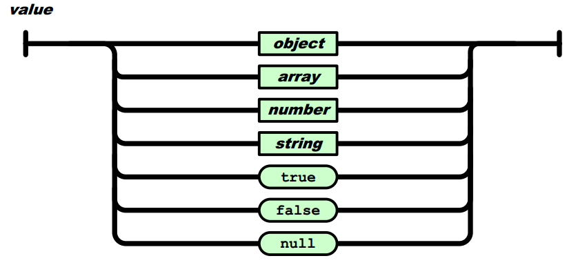

**Objects**

>An object structure is represented as a pair of curly backet tokens surrounding zero or more name/value pairs. A name is a string. A single colon token follows each name, separating the name  from the value. A single comma token separates a value from a following name

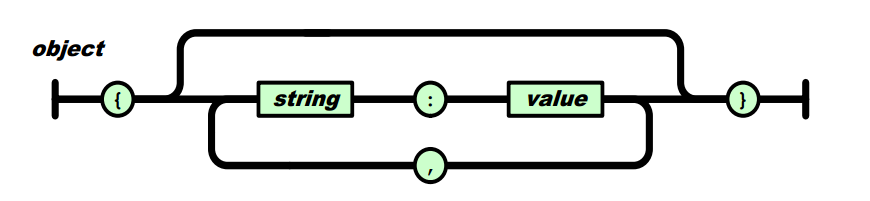

**Arrays**

>An array structure is a pair of square backet tokens surrounding zero or more values. The values are separated by commas. The order of the values is significant

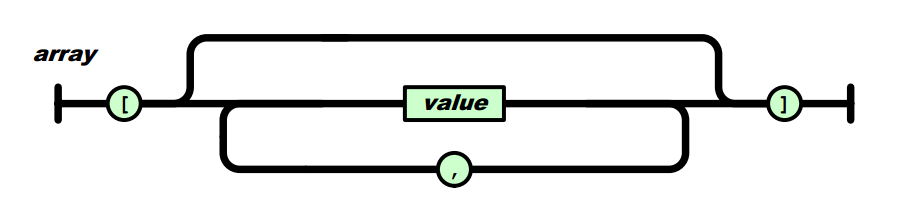

**Numbers**

>A number is represented in base 10 with no superefuous leading zero. It may have a preceding minus sign (U+002D). It may have a . (U+002E) prefixed fractional part. It may have an exponent of ten, prefixed by e (U+0065) or E (U+0045) and optionally + (U+002B) or - (U+002D). The digits are the code points U+0030 through U+0039

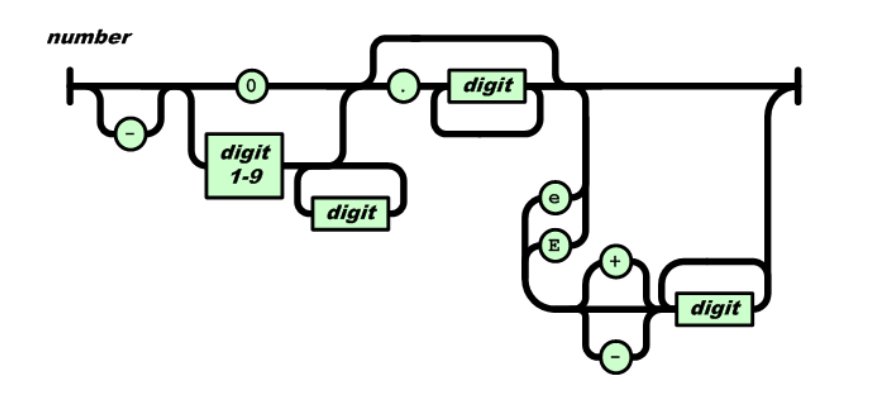

**String**

>A string is a sequence of Unicode code points wrapped with quotation marks (U+0022). All characters may be placed with the quotatioon marks except for the characters that must be escaped: quotation mark (U+0022), reverse solidus (U+005C), and the control character U+0000 to U+001F. There are two-character escaped sequence representations of some characters

* `\"` represents the quotation mark character (U+0022)
* `\\` represents the reverse solidus character (U+005C)
* `\/` represents the solidus character (U+002F)
* `\b` represents the backspace character (U+0008)
* `\f` represents the form feed character (U+000C)
* `\n` represents the line feed character (U+000A)
* `\r` represents the carriage return character (U+000D)
* `\t` represents the tabulation character (U+0009)

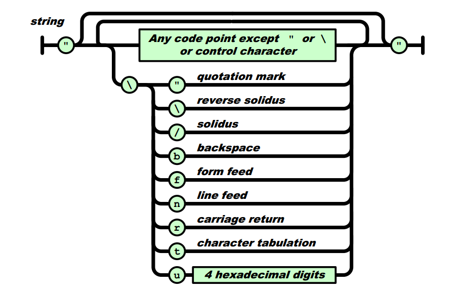

## JSON库

JSON只包含6种数据结构

* null：表示为null
* boolean：表示为true或false
* number：一般的浮点数表示方式
* string：表示为"..."
* array：表示为[...]
* object：表示为{...}

要实现的JSON库，在功能上需要完成至少3个功能：

* 把JSON文本解析为一个树状数据结构（parse）
* 提供接口访问该数据结构（access）
* 把数据结构转换成JSON文本（stringfy）

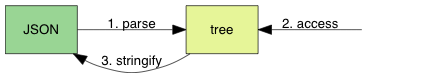

## JSON语法描述

[RFC7159](https://tools.ietf.org/html/rfc5234)的[ABNF](https://tools.ietf.org/html/rfc5234)表示JSON的语法子集

cJson是一个手写的递归下降解析器。由于JSON语法特别简单，我们不需要写分词器，只需检测下一个字符，便可知道它是哪种类型的值，然后调用相关的分析函数。对于完整的JSON语法，跳过空白后，只需检测当前字符

* `n` --> null
* `t` --> true
* `f` --> false
* `"` --> string
* `0-9/-` --> number
* `[` --> array
* `{` --> object

## null/false/true语法

```
JSON-text = ws value ws
ws = *(%x20 / %x09 / %x0A / %x0D)
value = null / false / true
null = "null"
false = "false"
true = "true" 
```

>其中`%xhh`表示以16进制表示的字符。ABNF中，`/`是多选一，`*`是零或多个，`()`用于分组

第一行的意思是，JSON文本由3部分组成，首先是空白（whitespace），接着是一个值，最后是空白

第二行告诉我们，所谓空白，是由零个或多个空格符（space U+0020、制表符（tab U+0009）、换行符（LF U+000A）、回车符（CR U+000D）所组成

第三行是说，我们现时的值只可以是null、false、true，他们分别有对应的字面值（literal）

## JSON数值型语法

```
number = ["-"] int [frac] [exp]
int = "0" / digit1-9 *digit
frac = "." 1*digit
exp = ("e" / "E") ["-" / "+"] 1*digit
```

>ABNF中，`/`是多选一，`*`是零或多个，`()`用于分组，`[]`表示可选项

number是以10进制表示，它主要you部分顺序组成：负号、整数、小数、指数。只有整数是必须部分。注意和直觉可能不同的是，正号是不合法的

整数部分如果是0开始，只能是单个0；而由1-9开始的话，可以加任意数量的数字（0-9）。也就是说，0123是不合法的JSON数字

小数部分比较直观，就是小数点后是一个或多个数字（0-9）

JSON可使用科学计数法，指数部分由大写E或小写e开始，然后可有正负号，之后是1或多个数字（0-9）

## JSON字符串语法

```
string = quotation-mark *char quotation-mark
char = unescaped /
   escape (
      %x22 /                ; "  quotation mark   U+0022
      %x5C /                ; \  reverse solidus  U+005C
      %x2F /                ; /  solidus          U+002F
      %x62 /                ; b  backspace        U+0008
      %x66 /                ; f  form feed        U+000C
      %x6E /                ; n  line feed        U+000A
      %x72 /                ; r  carriage return  U+000D
      %x74 /                ; t  tab              U+0009
      %x75 4HEXDIG )        ; uXXXX               U+XXXX
escape = %x5C               ; \
quotation-mark = %x22       ; "
unescaped = %x20-21 / %x23-5B / %x5D-10FFFF
```

简单翻译一下，JSON字符串是由前后两个双引号夹着两个或多个字符串

字符串分开无转义字符或转义序列

转义序列有9中，都是以反斜线开始，如常见的\n表示换行。比较特殊的是\uXXXX，当中XXXX为16进制的UTF-16编码

无转移字符就是普通字符，语法中列出了合法的码点范围。要注意的是，该范围不包括0~31、双引号、反斜线，这些码点都必须要使用转义方式表示

## JSON数组语法

一个JSON数组可以包含零至多个元素，而这些元素也可以是数组类型。换句话说，我们可以表示嵌套的数据结构，JSON数组的语法如下

```
array = %x5B ws [ value *(ws %x2C ws value) ] ws %x5D
```

其中，%x5B是左中括号`[`，%x2C是逗号`,`，%x5D右中括号`]`，ws是空白字符。一个数组可以包含零至多个值，以逗号分隔，例如`[]`、`[1,2,true]`、`[[1,2],[3,4],"abc"]`都是合法的数组。但注意JSON不接受末端额外的逗号，例如`[1,2,]`是不合法的

>许多编程语言如C/C++、JavaScript、Java、C#都容许数组初始化包含末端逗号。这就和编译原理又建立了一个联系！

## JSON对象语法

JSON对象和JSON数组非常相似，区别包括JSON对象以花括号`{} (U+007B、U+007D)`包裹表示，另外JSON对象由对象成员（member，键值对，使用冒号`:`U+003A分隔）组成，而JSON数组由JSON值组成。完整的语法描述如下

```
member = string ws %3A ws value
object = %x7B ws [ member *(ws %x2C ws member ) ] ws %x7D
```

## JSON生成器

以上的语法分析，以及编码实现这些语法的过程中，可以成功的将JSON文本解析成一个树形数据结构

JSON生成器负责相反的事情，就是把树形结构转换成JSON文本。这个过程又叫做字符串化（stringify）

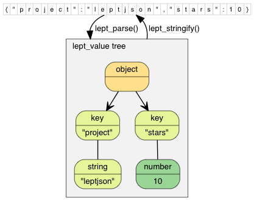

相对于解析器，通常生成器更容易实现，而且生成器几乎不会造成运行时错误

在实现JSON解析时，我们加入了一个动态变长的堆栈，用于存储临时的解析结果。而现在我们也需要存储生成的结果，所以最简单就是再利用该数据结构作为输出缓冲区

## 字符串解析成数值的性能

本例中使用`double strtod(const char *nptr, char **endptr);`来实现解析

strtod扫描nptr字符串，跳过前面的空格字符，直到遇上数字或正负符号才开始转换，到出现非数字或字符串结束时('\0')才转换结束并返回，若endptr不是NULL，则会将遇到不合条件而终止的nptr中的字符指针由endptr传回

实际上一些JSON库会采用更复杂的方案，例如支持64位带符号/无符号证书，自行实现转换，在RapidJson中解析/生成数字类型可以说是最难实现的部分，也是RapidJSON高效性能的原因

有一些JSON解析器不使用strtod()自行转换，例如正在校验的同时，记录符号、尾数（整数和小数）和指数，然后navie地计算

```
int negative = 0;
int64_t mantissa = 0;
int exp = 0;

//解析... 并存储negative、mantissa、exp
v->n = (negative ? -mantissa : mantissa) * pow(10.0, exp);
```

这种做法会有精度问题。实现正确的答案是很复杂的，RapidJSON的初期版本也是naive的，后来RapidJSON就内部实现了三种算法（使用kParseFullPrecision选项开启），最后一种算法用到了大整数（高精度计算）

>相关可以参考Google的[double-conversion](https://github.com/google/double-conversion)开源项目及相关论文

## UTF-8编码格式

ASCII是一种字符编码，把128个字符映射至整数0~127。例如1-->49，A-->65，B-->66等等。这种7-bit字符编码系统非常简单，在计算机中以一个字节存储 一个字符。然而，它仅适合英国英文，甚至一些英语中常用的标点符号、重音符号都不能表示，无法表示各国语言，特别是中日韩与等表意文字

在Unicode出现之前，各地区制定了不同的编码系统，如中文主要用GB2312和大五码，日语主要用JIS等。这样会造成很多不便，例如一个文本信息很难混合各种语言的文字

因此，在上世纪80年代末，Xerox、Apple等公司开始研究，是否能制定一套多语言的统一编码系统，于是多个机构成立了Unicode联盟

......

**我的问题**

一直以来对于UTF-8、GBK等编码格式的理解很表象，没有深刻理解它们设计背后的技术思考，以及在兼容性等方面的细节

[《从零开始的 JSON 库教程》](https://zhuanlan.zhihu.com/json-tutorial)的教程中有讲解对于UTF-8格式的处理，但是目前理解还是不够深刻、暂时没有进行实现！

>这些都是计算机技术底层的知识，可以好好思考，往深了钻

## JSON树形结构

JSON本身是一个树形结构，解析得到的各个节点用树形结构存储

## 解析字符串使用栈

在解析JSON字符串时，因为在开始时不能知道字符串的长度，而又需要进行转义，所以需要一个临时缓存区去存储解析后的结果。因此我们实现了一个动态增长的堆栈，可以不断压入字符，最后一次性把字符串弹出，复制到新分配的内存中

## 存储数组使用C的数组还是使用链表

JOSN数组存储零至多个元素，最简单就是使用C语言的数组。数组最大的好处是能以O(1)用索引访问任何元素，次要好处是内存布局紧凑，省内存值域还有高缓存一致性（cache coherence）。但数组的缺点是不能快速插入元素，而且我们在解析JSON数组的时候，还不知道应该分配多大的数组才合适

另一个选择是链表，它的最大优点是可以快速插入元素（开端、末端或中间），但需要以O(n)时间去索引取的内容。如果我们只需要顺序遍历，那么是没有问题的。还有一个小缺点，就是相对数组而言，链表在存储 每个元素时都有额外内存开销（存储下一节点的指针），而且遍历时元素所在的内存可能不连续，令缓存不命中的机会上升！

有一些JSON库选择了链表，这里选择数组。通过之前在解析字符串时实现的栈来解决JSON数组时未知数组大小的问题！

>但是这样删除JSON元素就会很慢了！

## 解析数组使用栈

对于JSON数组，也可以使用相同的方法，而且可以使用同一个堆栈！只需要把每个解析好的元素压入堆栈，解析到数组结束使，再一次性把所有元素弹出，复制到新分配的内存之中

单和字符串有点不一样，如果把JSON当做一颗树的数据结构，JSON字符串是叶节点，而JSON数组是中间节点。在叶节点的解析函数中，我们怎么使用那个堆栈也可以，只要最后还原就好。但是对于数组这样的中间节点，共用这个堆栈没有问题吗？

答案是：只要在解析函数结束还原堆栈的状态就没有问题，为了直观地了解这个解析过程，我们用连环图去展示`["abc",[1,2],3]`的解析过程！

首先我们遇到`[`，进入ParseArray():

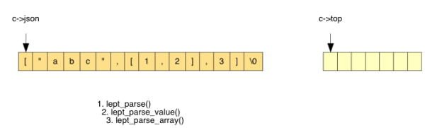

生成一个临时的CJSONValue，用于存储之后的元素。我们再调用ParseValue()去解析这个元素值，因为遇到了`"`进入ParseString()

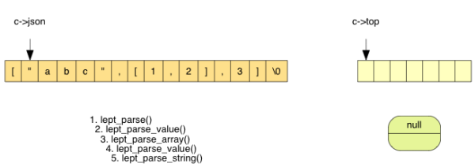

在ParseString中，不断解析字符直到遇到`"`，过程中把每个字符压栈

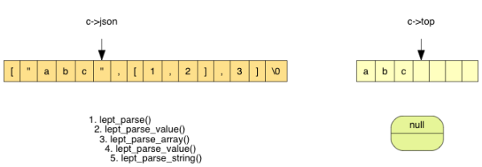

最后在ParseString()中，把栈上3个字符弹出，分配内存，生成字符串值

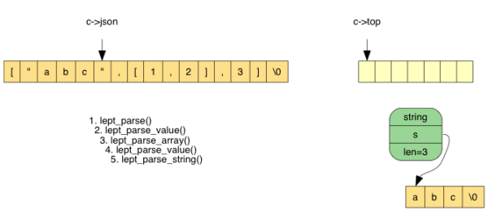

返回到上一层ParseArray()，把临时元素压栈

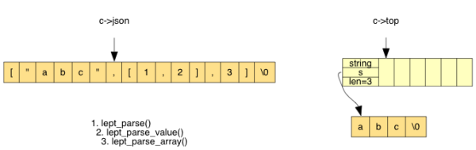

然后，我们再遇到`[`，进入另一个ParseArray()，它发现第一个元素是数字型，所以调用ParseNumber()，生成一个临时的元素值

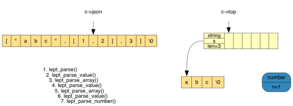

之后把该临时元素的值压入栈

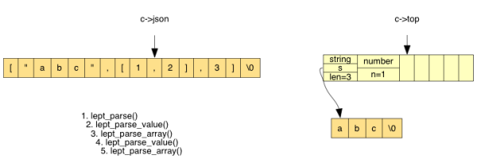

接着再解析第二个元素。遇到了`]`，从栈上弹出两个元素，分配内存，生成数组（虚线代表连续的内存）

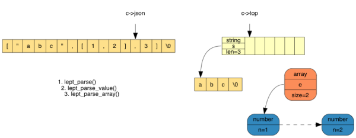

这个数组是上层数组的元素，把它压栈。现在栈中有两个元素，继续解析下一个元素

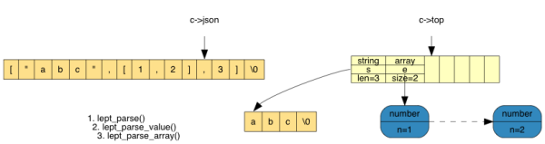

最后，遇到了`]`，可以弹出栈中3个元素，分配内存，生成数组：

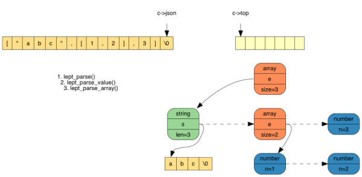

>可以看到通过利用栈、递归完美的构造了一颗树！

## 解析JSON对象

表示键值对的集合，有很多种数据结构可选，例如

* 动态数组（dynamic array）：可扩展容量的数组，如C++的[std::vector](http://en.cppreference.com/w/cpp/container/vector)
* 有序动态数组（sorted dynamic array）：和动态数组相同，但保证元素已排序，可用二分搜索查询成员
* 平衡树（balanced tree）：平衡二叉树可有序地遍历成员，如红黑树和C++的[std::map](http://en.cppreference.com/w/cpp/container/map)（[std::multi_map](http://en.cppreference.com/w/cpp/container/multimap)支持重复键）
* 哈希表（hash table）：通过哈希函数能实现平均O(1)查询，如C++11的[std::unordered_map](http://en.cppreference.com/w/cpp/container/unordered_map)（[unordered_multimap](http://en.cppreference.com/w/cpp/container/unordered_multimap) 支持重复键）

设一个对象有n个成员，数据结构的容量是m，(n <= m)，那么常用操作的时间/空间复杂度如下

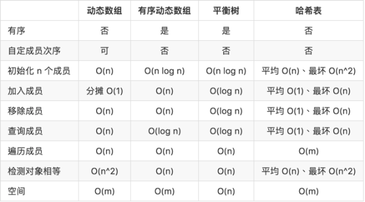

这个简单的JSON库实现中，选择使用动态数组的方案

## 关于算法和数据结构的思考

>在软件开发过程中，许多时候，选择合适的数据结构后就等于完成了一半工作。没有完美的数据结构，所以最好考虑多一些应用的场合，看看时间/空间复杂度以及相关系数是否合适

>其实在编译原理中大量用到算法和数据结构的知识！

>单纯的写算法、数据结构没啥意思，还是要在比如编译原理编程、系统架构等方面具体应用数据结构才行！

>在实现cJson的过程中对数据结构的理解更加深刻了，但是自己的熟练度还是不够，所以类似的项目还必须更多的练习！

## 反思软件工程

这次更好的使用了assert、宏、单元测试

何时使用断言、何时处理运行时错误（如返回错误值或在C++中抛出异常）。简单的答案是：如果那个错误是由于程序员错误编码所造成的（比如传入不合法的参数），那么应该使用断言；如果那个错误是程序员无法避免的，而是由运行时的环境所造成的，就要处理运行时错误（比如开启文件失败）

相比于cDBF的实现、单元测试更加规范化

写单元测试也没有什么难的，但是编程质量明显上了一个台阶。而且深刻的体会到一点：写了测试用例，后续对程序有了任何修改（可能同步添加新的测试用例），只要在修改之后跑一遍测试用例就可以方便地进行回归、测试，很省力！

在软件工程中，**代码重构**是指在不被改变软件外在行为的情况下修改代码以改进结构。代码重构十分依赖于单元测试，因为我们是通过单元测试去维护代码的正确性。有了足够的单元测试，我们可以放胆去重构，尝试并评估不同的改进方式，找出合乎心意且能通过单元测试的改动，我们才可以提交它

## 反思编译原理

之前实现的[Delphi源码解析器](https://github.com/HackerLaboratory/_Laboratory/tree/master/_Idea/_XCopyer)的时候其实出现过很多解析错误的情况，很重要的一个原因就是没有能像这里模仿实现JSON的解析中先规定好严格的语法，比如如下数值型的语法定义准确后，需要在代码中结合语法定义来考虑针对各种可能情况的处理！

```
number = ["-"] int [frac] [exp]
int = "0" / digit1-9 *digit
frac = "." 1*digit
exp = ("e" / "E") ["-" / "+"] 1*digit
```

当然完善的单元测试也是必要的，结合语法描述写出各种边界场景。我在Delphi源码解析器的实现中也有做单元测试，但是很不充分，就简单的写了几个而已

所以在编译器领域，怎么保证准确的描述语法本身是极其重要的事情！另一个同样重要的就是如何将这种语法描述翻译为代码实现！

>其实实现一个JSON的解析器相对是简单的，但是有这方面的经验是极好的！有了这个经验，以后你工作想要嵌入一个DSL之类或者写一个编程语言也是水到渠成的事情

## GDB软件调试

>使用调试工具一步一步跟踪程序执行、分析每一步背后的原理是极好的理解程序逻辑的方法

>如果再能做一些反汇编、分析汇编、分析寄存器、分析线程、分析栈、分析堆内存等的工作就更好了

首先编译的时候要加`-g`参数

`b/break test.c:125`在test.c文件的第125行下断点；`b cJson.c:Parse`在cJson.c的Parse函数上下断点

`info break`列出当前所有断点

`disable 2`使2号断点失效；`enable 2`使2号断点又生效

`n/next`下一行，不进入子函数内部；`s/step`进入子函数内部；`c/continue`继续执行

`p/print a`打印出变量a的值

......更多命令

## 扩展阅读

* [《从比并 JSON 库谈开源意义》](https://zhuanlan.zhihu.com/p/22399604)
* [《RapidJSON 代码剖析（一）：混合任意类型的堆栈》](https://zhuanlan.zhihu.com/p/20029820)
* [《RapidJSON 代码剖析（二）：使用 SSE4.2 优化字符串扫描》](https://zhuanlan.zhihu.com/p/20037058)
* [《RapidJSON 代码剖析（三）：Unicode 的编码与解码》](https://zhuanlan.zhihu.com/p/20056322)
* [《RapidJSON 代码剖析（四）：优化 Grisu》](https://zhuanlan.zhihu.com/p/20092285)
* [《使用 CRT 库查找内存泄漏》](https://msdn.microsoft.com/zh-cn/library/x98tx3cf.aspx)
* [《STL 的 vector 有哪些封装上的技巧？》](https://www.zhihu.com/question/25079705/answer/30030883)
